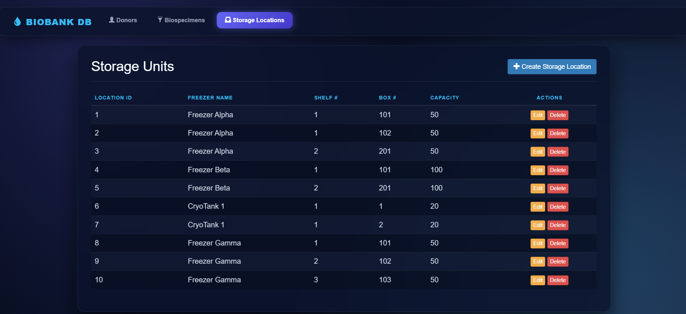

# Biobank and Biospecimen Management System

## Overview

This project implements a MySQL relational database for managing donors, consent records, biospecimens, aliquots, sample types, storage locations, researchers, test requests, and aliquot assignments. It supports biospecimen traceability from donor consent through storage and research testing.

The project intentionally has no user interface. The `src/` directory is retained for the optional bonus application only; the required database, documentation, ERD, and presentation are independent of a UI.

## DBMS


Run the scripts on a clean MySQL session in this order:

```sql
SOURCE /absolute/path/to/sql/create_tables.sql;
SOURCE /absolute/path/to/sql/load_data.sql;
SOURCE /absolute/path/to/sql/views.sql;
SOURCE /absolute/path/to/sql/triggers_procedures.sql;
SOURCE /absolute/path/to/sql/queries.sql;
SOURCE /absolute/path/to/sql/testing.sql;
```


## Repository structure

| Path | Purpose |
|---|---|
| `README.md` | Project overview, DBMS information, execution order, and testing notes. |
| `report.docx` | Complete written report aligned with the ERD and SQL implementation. |
| `presentation/` | Presentation source project. |
| `sql/create_tables.sql` | Database, nine tables, keys, constraints, and indexes. |
| `sql/load_data.sql` | Sample data: ten donors, consents, biospecimens, aliquots, researchers, and requests, plus lookup and assignment data. |
| `sql/queries.sql` | Retrieval, join, aggregation, nested query, INSERT, UPDATE, DELETE, view, and procedure examples. |
| `sql/views.sql` | `view_available_aliquots_detail` and `view_researcher_request_summary`. |
| `sql/triggers_procedures.sql` | `trg_check_aliquot_volume` and `sp_GetDonorFullHistory`. |
| `sql/testing.sql` | Row counts, view tests, procedure test, trigger test, foreign-key test, and index checks. |
| `diagrams/ERD.png` | Final entity–relationship diagram. |
| `src/` |  UI/application source;  |


### Web Application




